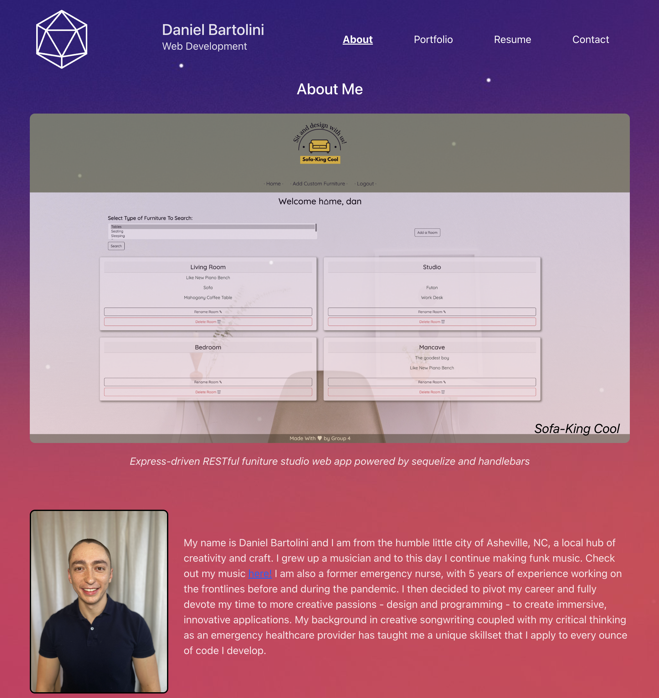

# React Portolfio

[Click Here to Access Live App](https://djbartolini.github.io/react-portfolio/)

My name is Daniel Bartolini, and this is my portfolio! I hope you enjoy. I will be expanding upon it more and more in the near future.

## Table of Contents
  * [Usage](#usage)
  * [Contriuting](contributing)
  * [License](#license)
  * [Support](support)

## Usage
Visit [this link](https://djbartolini.github.io/react-portfolio/) to access my portfolio. Each app listed in the portfolio is a clickable link that will redirect you to that app (or its codebase if it is a server-side app). There is a contact form if you would like to contact me. Thank you!

## Contibuting
This app was made using:
* [React](https://reactjs.org/)
* [Vite](https://vitejs.dev/)
* [Node.js](https://nodejs.org/en/)

## License
This app is covered under the MIT license: [MIT](https://opensource.org/licenses/MIT)

## Support
If you encounter problems with this README generator, please reach out to me on GitHub at: https://github.com/djbartolini, or email me at dan@bartolini.dev.
  